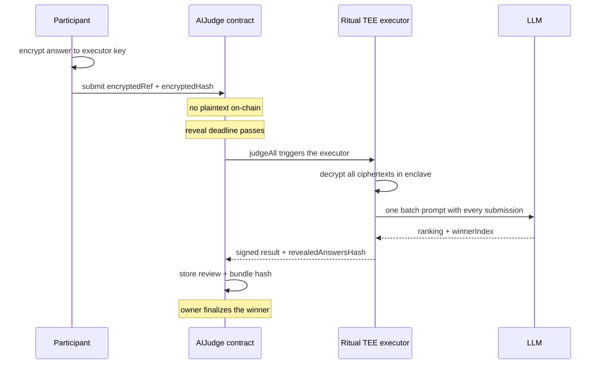

# Architecture notes

This compares the required commit-reveal design with a Ritual-native design that
keeps answers encrypted through judging.

## The fairness problem

The workshop contract stored answers as plaintext on submit. Public chain state
is readable by anyone, so a participant could watch the mempool and storage,
read earlier answers, and submit an improved version before the deadline. The
goal is to keep answers hidden until judging is done.

## Required track: commit-reveal

The answer is hashed off-chain and only the hash is published during submission.
After submission closes, the participant reveals the answer and salt, and the
contract verifies the hash before accepting it.

```
create  ->  commit (hash only)  ->  reveal (answer + salt)  ->  judge  ->  finalize
            submission window        reveal window              owner     owner
```

What is public and what is hidden:

| Data | Where | Visible during submission |
| --- | --- | --- |
| Commitment hash | on-chain | yes |
| Submitter address | on-chain | yes |
| Deadlines, reward, rubric | on-chain | yes |
| Answer text | off-chain until reveal | no |
| Answer text after reveal | on-chain | yes, after reveal |

The hash binds `answer`, `salt`, `msg.sender`, and `bountyId`. The salt stops an
attacker from guessing short answers by brute force, and the sender binding
stops one participant from replaying another's commitment.

What this design does not solve: once the reveal window opens, every revealed
answer becomes public on-chain before the LLM runs. Commit-reveal guarantees
that nobody could change their answer after submission, which removes the
copy-and-improve attack. It does not keep the plaintext private from the LLM
step. That is the gap the advanced track closes.

## Advanced track: Ritual-native hidden submissions

The idea is to never put plaintext on-chain at all, and let the TEE executor be
the only place answers are decrypted.

### Flow

1. **Encrypt.** Each participant encrypts their answer to the Ritual TEE
   executor public key with ECIES. This is the same key flow the sovereign agent
   tooling uses when it encrypts a payload to the executor before sending it
   on-chain.
2. **Submit a reference.** The participant pins the ciphertext off-chain (for
   example IPFS) and submits only `encryptedRef` and `encryptedHash` on-chain,
   or submits the ciphertext bytes directly if it is small. No plaintext is
   stored.
3. **Hidden by construction.** Before judging, only the TEE holds the
   decryption key, so no other participant can read any answer.
4. **Judge inside the enclave.** `judgeAll` triggers the executor. Inside the
   TEE it pulls every ciphertext, decrypts them privately, builds one batch
   prompt that contains all submissions, and runs a single LLM inference. It
   returns a signed result with the winner index, a ranking, and a hash of the
   revealed bundle.
5. **Reveal the bundle.** After judging, the system publishes the revealed
   answers bundle off-chain and stores `revealedAnswersRef` and
   `revealedAnswersHash` on-chain, so anyone can fetch the bundle, hash it, and
   confirm it matches the answers that were judged.

### On-chain versus off-chain

| Data | On-chain | Off-chain |
| --- | --- | --- |
| Encrypted answer reference and hash | yes | ciphertext itself |
| Submitter address, deadlines, reward | yes | |
| Decryption key | no | held by the TEE |
| Plaintext answers before judging | never | nowhere readable |
| Revealed bundle reference and hash | yes | bundle itself |

### How the LLM receives all submissions together

The executor decrypts each ciphertext in the enclave and assembles them into a
single messages array: a system prompt plus one user message holding a JSON
array of all submissions. That is one inference request for the whole bounty,
not one call per answer. Batch judging is required so the model ranks every
entry against the same context in a single pass.

### How the contract commits to the final bundle

The contract stores `revealedAnswersHash`, the keccak256 of the canonical
revealed bundle. A verifier downloads the bundle from `revealedAnswersRef`,
hashes it, and compares. If they match, the published answers are exactly the
set that was judged.

### Sequence



## Comparison

| Property | Commit-reveal | Ritual-native TEE |
| --- | --- | --- |
| Hidden during submission | yes | yes |
| Hidden during judging | no, revealed first | yes |
| Works on any EVM chain | yes | needs Ritual TEE |
| Needs a reveal step from users | yes | no, executor decrypts |
| Non-reveal griefing | possible, entry is dropped | not an issue |
| Extra trust assumption | none | TEE integrity and key management |

Commit-reveal is simple and portable but exposes plaintext before judging.
The TEE design keeps answers private end to end at the cost of trusting the
enclave and depending on Ritual infrastructure.
